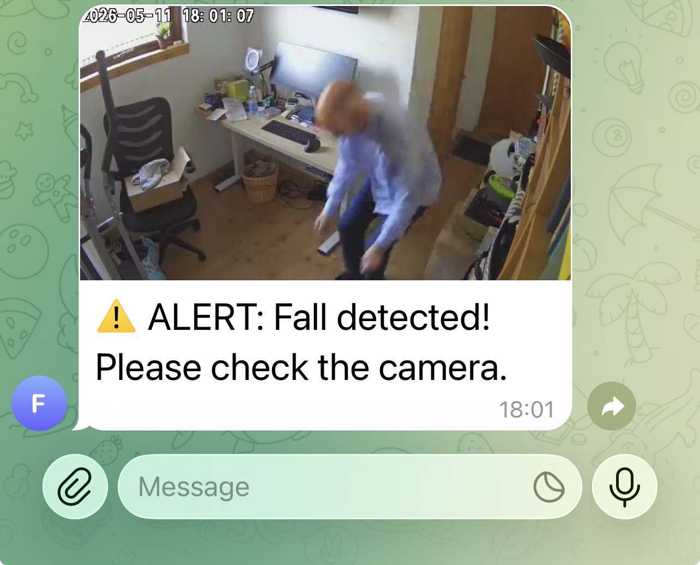

# AI Fall Detection for Elderly Care

A localised, privacy-first fall detection system designed to run on a Raspbery Pi or a basic Linux PC (N100). It monitors ONVIF/RTSP camera streams and sends instant photo alerts to a Telegram group when a fall is detected using Computer Vision.



## Features

* **Real-time Pose Estimation:** Uses YOLOv8-Pose to identify human skeletons.
* **Privacy-Focused:** All video processing happens locally. No cloud video storage.
* **Multi-Camera Support:** Monitor multiple rooms simultaneously from one device.
* **Instant Notifications:** Sends a snapshot of the event to a Telegram Supergroup.
* **Hardware Optimized:** Uses `imgsz=320` and `stream=True` to maintain high FPS on low-power hardware.

## Hardware Requirements

* **Processor:** Ubuntu Mini PC (Intel N100 or similar) or Raspberry Pi 5.
* **Cameras:** Any IP camera supporting **ONVIF/RTSP** (e.g., Reolink, Amcrest, Tapo).
* **Internet:** Required only for sending Telegram alerts.

## Installation

1. **Clone the repository:**
```bash
git clone https://github.com/andywestthorp/fall-detection.git
cd fall-detection

```


2. **Create a virtual environment:**
```bash
python3 -m venv fall_env
source fall_env/bin/activate

```


3. **Install dependencies:**
```bash
pip install ultralytics opencv-python requests

```


## Configuration

Open `fall.py` and update the following variables:

| Variable | Description |
| --- | --- |
| `TOKEN` | Your Telegram Bot Token from [@BotFather](https://t.me/botfather). |
| `CHAT_ID` | Your Telegram Group ID (e.g., `-100xxxxxxxxxx`). |
| `CAMERAS` | A list of your RTSP stream URLs. |
| `COOLDOWN` | Time in seconds to wait between duplicate alerts. |

## Usage

Run the monitor using your virtual environment:

```bash
python fall3.py

```

### Key Commands:

* **'q'**: Quit the monitor.
* **Ctrl+C**: Stop the process in the terminal.

## Detection Logic

The system triggers an alert based on two main mathematical checks:

1. **Aspect Ratio:** If the bounding box width is significantly greater than the height ($W > H \times 1.2$).
2. **Vertical Threshold:** If the center of the detected person drops into the bottom 25% of the frame, where feet are typically located.

## Contributing

Feel free to fork this project and submit pull requests. Future goals include adding **OpenVINO** support for Intel integrated graphics and a web-based dashboard for masking "safe zones" like sofas or beds.

---
